# Coastal Threads Analytics

End-to-end e-commerce retention analytics pipeline for a DTC fashion retailer.

## Problem

Coastal Threads is an online DTC fashion retailer with ~$2M revenue and ~30K customers. **68% of customers never make a second purchase.** Marketing has no attribution visibility, and the CEO is asking: who are our best customers, which channels drive retention, and where should we focus budget?

## Solution

A complete analytics pipeline built with **dbt + PostgreSQL + Streamlit** that delivers:

- **RFM Segmentation** — Identifies Champions, Loyal, At Risk, and Hibernating customers using Recency, Frequency, and Monetary scoring
- **Last-Touch Attribution** — Maps every order to the most recent marketing touchpoint, revealing which channels drive conversions
- **Cohort Retention Analysis** — Tracks monthly acquisition cohorts across 30/60/90/180/365-day retention windows
- **Interactive Dashboard** — Three-tab Streamlit app with executive KPIs, segment deep-dives, and channel performance

## Architecture

```mermaid
graph LR
    subgraph Sources
        A[Shopify<br/>Customers, Orders, Items, Products] --> S
        B[Stripe<br/>Payments] --> S
        C[Klaviyo<br/>Customer Events] --> S
    end

    subgraph S[Staging Layer]
        S1[stg_shopify__customers]
        S2[stg_shopify__orders]
        S3[stg_shopify__order_items]
        S4[stg_shopify__products]
        S5[stg_stripe__payments]
        S6[stg_klaviyo__events]
    end

    subgraph I[Intermediate Layer]
        I1[int_orders_enriched]
        I2[int_customers_rfm_scored]
        I3[int_orders_attributed]
        I4[int_cohorts_monthly]
    end

    subgraph M[Marts Layer - Kimball Star Schema]
        D1[dim_customers<br/>SCD Type 2]
        D2[dim_products]
        D3[dim_date]
        D4[dim_channels]
        F1[fct_orders<br/>Grain: line item]
        F2[fct_customer_events<br/>Grain: event]
    end

    subgraph Dashboard
        ST[Streamlit App<br/>3 Tabs]
    end

    S --> I --> M --> Dashboard
```



## Key Findings

- **Champions** (12% of customers) generate **41% of revenue** — targeted loyalty programs projected to increase CLV by $18/customer
- **Email-acquired customers** retain at **2.3x the rate** of paid social — recommending 30% budget reallocation from paid social to email
- **79% attribution coverage** across all orders via last-touch model
- Monthly cohort analysis reveals seasonal spikes in retention during holiday periods

## Business Impact

> "Identified that email-acquired customers retain at 2.3x the rate of paid social, enabling a recommended 30% budget reallocation. RFM segmentation revealed 12% of customers ('Champions') generate 41% of revenue — targeted loyalty program projected to increase CLV by $18/customer."

## Tech Stack

| Layer | Tool |
|-------|------|
| Data Warehouse | PostgreSQL 18 |
| Transformation | dbt-core 1.11 |
| Synthetic Data | Python (Faker, NumPy, Pandas) |
| Dashboard | Streamlit + Plotly |
| Testing | dbt tests (57 data tests + 3 custom SQL) |

## Project Structure

```
coastal-threads-analytics/
├── models/
│   ├── staging/
│   │   ├── shopify/          # 4 staging models + sources
│   │   ├── stripe/           # 1 staging model + sources
│   │   └── klaviyo/          # 1 staging model + sources
│   ├── intermediate/         # RFM, attribution, cohorts, enriched orders
│   └── marts/                # Kimball dimensional: 4 dims + 2 facts
├── tests/                    # Custom SQL tests
├── scripts/
│   └── generate_synthetic_data.py
├── dashboards/
│   └── app.py                # Streamlit dashboard
└── docs/
    ├── data_dictionary.md
    └── architecture_diagram.md
```

## How to Run

### Prerequisites

- PostgreSQL (with a `portfolio` database)
- Python 3.11+ with: `dbt-postgres`, `faker`, `pandas`, `numpy`, `streamlit`, `plotly`, `psycopg2-binary`, `sqlalchemy`

### Setup

```bash
# 1. Generate synthetic data and load to PostgreSQL
python scripts/generate_synthetic_data.py

# 2. Install dbt packages
dbt deps

# 3. Build all models and run tests
dbt build --full-refresh

# 4. Generate dbt documentation
dbt docs generate
dbt docs serve

# 5. Launch the dashboard
streamlit run dashboards/app.py
```

### Database Connection

Update `~/.dbt/profiles.yml` with your PostgreSQL credentials:

```yaml
coastal_threads:
  target: dev
  outputs:
    dev:
      type: postgres
      host: localhost
      port: 5432
      user: your_user
      password: your_password
      dbname: portfolio
      schema: coastal_threads
      threads: 4
```

## Modeling Conventions

- **SQL**: snake_case, lowercase keywords, CTEs over subqueries
- **Naming**: `stg_<source>__<entity>`, `int_<entity>_<verb>`, `dim_<entity>`, `fct_<entity>`
- **Timestamps**: `<event>_at` (UTC)
- **IDs**: `<entity>_id` (natural), `<entity>_key` (surrogate)
- **Booleans**: `is_<x>` or `has_<x>`
- **dbt**: `ref()` everything, never hardcode table names

## References

- Kimball, R. *The Data Warehouse Toolkit* (3rd Ed.) — Star schema, SCD Type 2, conformed dimensions
- dbt Labs — [How We Structure Our dbt Projects](https://docs.getdbt.com/best-practices/how-we-structure/1-guide-overview)
- RFM Analysis — Score 1-5 per dimension, segment by composite score
- Last-Touch Attribution — Most recent marketing touchpoint before conversion
