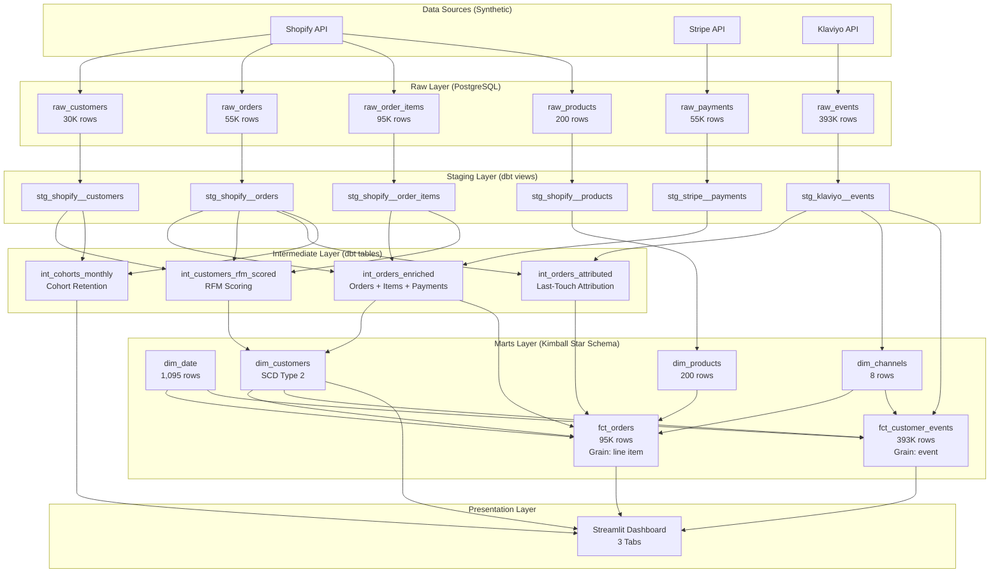
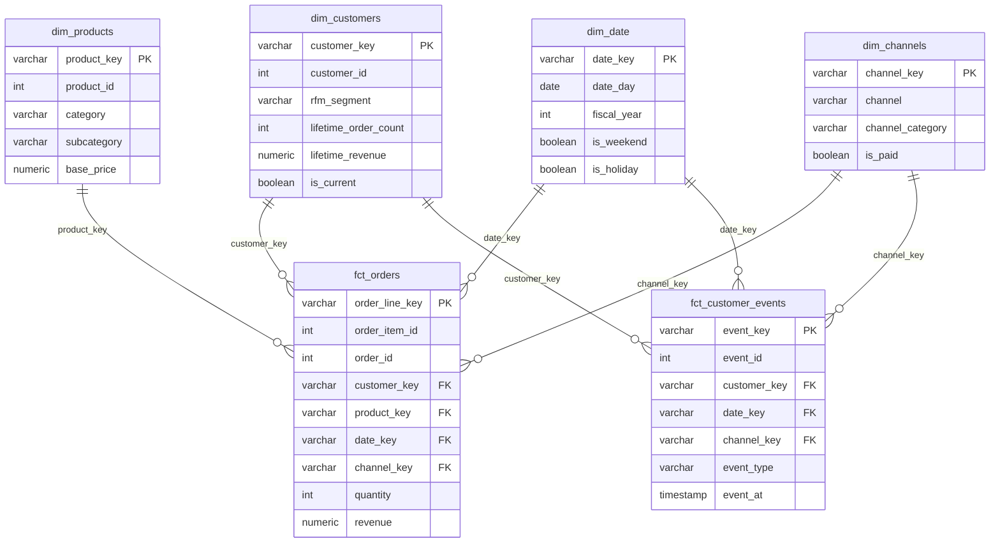

# Architecture Diagram

## Data Pipeline

```mermaid
graph TD
    subgraph "Data Sources (Synthetic)"
        SH[Shopify API]
        ST[Stripe API]
        KL[Klaviyo API]
    end

    subgraph "Raw Layer (PostgreSQL)"
        RC[raw_customers<br/>30K rows]
        RO[raw_orders<br/>55K rows]
        RI[raw_order_items<br/>95K rows]
        RP[raw_products<br/>200 rows]
        RPY[raw_payments<br/>55K rows]
        RE[raw_events<br/>393K rows]
    end

    SH --> RC
    SH --> RO
    SH --> RI
    SH --> RP
    ST --> RPY
    KL --> RE

    subgraph "Staging Layer (dbt views)"
        SC[stg_shopify__customers]
        SO[stg_shopify__orders]
        SI[stg_shopify__order_items]
        SP[stg_shopify__products]
        SPY[stg_stripe__payments]
        SE[stg_klaviyo__events]
    end

    RC --> SC
    RO --> SO
    RI --> SI
    RP --> SP
    RPY --> SPY
    RE --> SE

    subgraph "Intermediate Layer (dbt tables)"
        IOE[int_orders_enriched<br/>Orders + Items + Payments]
        IRFM[int_customers_rfm_scored<br/>RFM Scoring]
        IOA[int_orders_attributed<br/>Last-Touch Attribution]
        ICM[int_cohorts_monthly<br/>Cohort Retention]
    end

    SO --> IOE
    SI --> IOE
    SPY --> IOE
    SC --> IRFM
    SO --> IRFM
    SI --> IRFM
    SO --> IOA
    SE --> IOA
    SC --> ICM
    SO --> ICM

    subgraph "Marts Layer (Kimball Star Schema)"
        DD[dim_date<br/>1,095 rows]
        DC[dim_customers<br/>SCD Type 2]
        DPR[dim_products<br/>200 rows]
        DCH[dim_channels<br/>8 rows]
        FO[fct_orders<br/>95K rows<br/>Grain: line item]
        FCE[fct_customer_events<br/>393K rows<br/>Grain: event]
    end

    IRFM --> DC
    IOE --> DC
    SP --> DPR
    SE --> DCH
    IOE --> FO
    IOA --> FO
    DC --> FO
    DPR --> FO
    DD --> FO
    DCH --> FO
    SE --> FCE
    DC --> FCE
    DD --> FCE
    DCH --> FCE

    subgraph "Presentation Layer"
        DASH[Streamlit Dashboard<br/>3 Tabs]
    end

    DC --> DASH
    FO --> DASH
    FCE --> DASH
    ICM --> DASH
```

## Star Schema

```mermaid
erDiagram
    dim_customers ||--o{ fct_orders : customer_key
    dim_products ||--o{ fct_orders : product_key
    dim_date ||--o{ fct_orders : date_key
    dim_channels ||--o{ fct_orders : channel_key

    dim_customers ||--o{ fct_customer_events : customer_key
    dim_date ||--o{ fct_customer_events : date_key
    dim_channels ||--o{ fct_customer_events : channel_key

    fct_orders {
        varchar order_line_key PK
        int order_item_id
        int order_id
        varchar customer_key FK
        varchar product_key FK
        varchar date_key FK
        varchar channel_key FK
        int quantity
        numeric revenue
    }

    fct_customer_events {
        varchar event_key PK
        int event_id
        varchar customer_key FK
        varchar date_key FK
        varchar channel_key FK
        varchar event_type
        timestamp event_at
    }

    dim_customers {
        varchar customer_key PK
        int customer_id
        varchar rfm_segment
        int lifetime_order_count
        numeric lifetime_revenue
        boolean is_current
    }

    dim_products {
        varchar product_key PK
        int product_id
        varchar category
        varchar subcategory
        numeric base_price
    }

    dim_date {
        varchar date_key PK
        date date_day
        int fiscal_year
        boolean is_weekend
        boolean is_holiday
    }

    dim_channels {
        varchar channel_key PK
        varchar channel
        varchar channel_category
        boolean is_paid
    }
```
